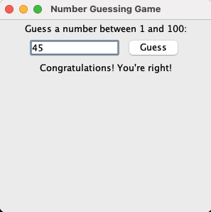

# Number Guessing Game

## Overview

This is a simple Number Guessing Game implemented in Java using the Swing library for the graphical user interface.

## Features

- The user is prompted to guess a number between 1 and 100.
- Provides feedback after each guess, indicating whether the guess is too low, too high, or correct.
- The game continues until the user correctly guesses the random number.
- Basic error handling for invalid inputs.

## How to Run

1. Ensure you have Java installed on your system.
2. Download the `NumberGuess.java` file.
3. Open a terminal or command prompt and navigate to the directory where the file is saved.
4. Compile the Java file using the following command:

    ```bash
    javac NumberGuess.java
    ```

5. Run the compiled program with:

    ```bash
    java NumberGuess
    ```

## Screenshots



## Contributing

Contributions are welcome! If you have any suggestions or improvements, please feel free to open an issue or submit a pull request.


